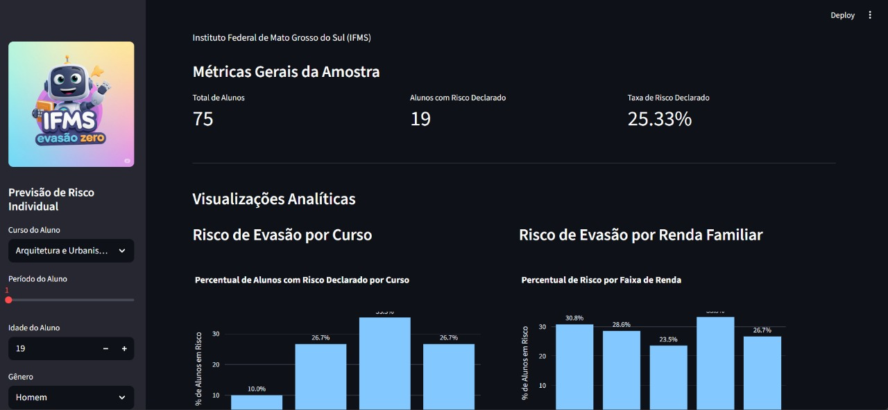

# 📊 EVASÃO-ZERO - Dashboard Preditivo de Evasão Estudantil

<p align="center">
  
</p>

<p align="center">
  <a href="#"></a>
  <a href="#"></a>
  <a href="#"></a>
  <a href="#"></a>
  <a href="LICENSE"></a>
</p>

---

## 🎯 Sobre o Projeto

**EVASÃO-ZERO** é uma aplicação de *Data Science* e *Machine Learning* desenvolvida para identificar precocemente estudantes com risco de evasão no contexto dos **Institutos Federais de Educação**.

### 📌 Contexto Importante

Este projeto utiliza **dados públicos do INEP (Instituto Nacional de Estudos e Pesquisas Educacionais Anísio Teixeira)** como base para desenvolvimento e validação do modelo preditivo. 

> **Nota:** Os dados reais do **Instituto Federal de Mato Grosso do Sul (IFMS)** ainda não estão disponíveis, pois aguardam aprovação do **Comitê de Ética em Pesquisa**. Assim que liberados, o modelo será retreinado com dados institucionais específicos.

### 🎯 Objetivos

- 🔍 **Identificação Precoce** → Detectar estudantes em risco de evasão antes que abandonem os estudos
- 📊 **Análise de Fatores** → Compreender os principais fatores correlacionados à evasão
- 🎯 **Apoio à Gestão** → Fornecer insights para ações proativas e personalizadas
- 🤖 **Predição em Tempo Real** → Simular perfis de alunos e avaliar risco instantaneamente

<details>
  <summary><b>📺 Clique para ver a demonstração da aplicação</b></summary>
  <br>
  <p align="center">
    
  </p>
</details>

---

## ✨ Principais Funcionalidades

- 📈 **Análises Visuais Interativas** → Gráficos dinâmicos sobre fatores correlacionados à evasão
- 📊 **KPIs em Tempo Real** → Métricas-chave do cenário atual da base de dados
- 🤖 **Modelo Preditivo ML** → Predição instantânea de risco baseada em Random Forest
- 🎯 **Simulador de Perfil** → Interface para testar diferentes perfis de estudantes
- 📉 **Análise por Segmentos** → Visualizações por curso, renda, gênero e outros fatores

---

## 🏗️ Arquitetura do Projeto

```
evasao-zero/
├── 📁 data/                    # Dados do projeto
│   ├── raw/                    # Dados brutos do INEP
│   ├── processed/              # Dados processados
│   └── external/               # Dados de terceiros
├── 📁 notebooks/               # Jupyter notebooks para análise
│   ├── 01_limpeza_e_analise.ipynb
│   └── 02_treinamento_do_modelo.ipynb
├── 📁 src/                     # Código-fonte modular
│   ├── config.py               # Configurações
│   ├── dataset.py              # Manipulação de dados
│   ├── features.py             # Engenharia de features
│   └── modeling/               # Módulos de ML
├── 📁 deployments/             # Aplicações deployáveis
│   ├── dashboard/              # Dashboard Streamlit
│   └── extension/              # Extensão de navegador
├── 📁 scripts/                 # Scripts utilitários
│   ├── download_dataset.py     # Download dados do HuggingFace
│   └── processar_microdados.py # Processamento INEP
├── 📁 models/                  # Modelos treinados (.joblib)
├── 📁 reports/                 # Relatórios e visualizações
├── 📁 docs/                    # Documentação (MkDocs)
├── 📁 tests/                   # Testes automatizados
├── pyproject.toml              # Configuração do projeto
├── uv.lock                     # Lock de dependências
└── Makefile                    # Comandos automatizados
```

---

## 🛠️ Stack Tecnológica

### Core
- **Python 3.8+** → Linguagem principal
- **uv** → Gerenciador de pacotes ultrarrápido

### Data Science & ML
- **pandas** → Manipulação de dados
- **numpy** → Computação numérica
- **scikit-learn** → Machine Learning
- **imbalanced-learn** → Tratamento de desbalanceamento

### Visualização & Dashboard
- **Streamlit** → Framework web interativo
- **Plotly** → Gráficos interativos
- **Matplotlib/Seaborn** → Visualizações estáticas

### DevOps & Qualidade
- **Ruff** → Linter e formatter
- **pytest** → Testes automatizados
- **MkDocs** → Documentação

---

## 🚀 Início Rápido

### 1️⃣ Pré-requisitos

- **Python 3.8+**
- **uv** (gerenciador de pacotes)

**Instalar o uv:**

```bash
# Windows
powershell -c "irm https://astral.sh/uv/install.ps1 | iex"

# macOS/Linux
curl -LsSf https://astral.sh/uv/install.sh | sh
```

### 2️⃣ Instalação

```bash
# Clone o repositório
git clone https://github.com/seu-usuario/evasao-zero.git
cd evasao-zero

# Sincronize dependências (cria ambiente virtual automaticamente)
uv sync
```

### 3️⃣ Download dos Dados

```bash
# Configure seu token do HuggingFace em scripts/.env
echo "HF_TOKEN=seu_token_aqui" > scripts/.env

# Baixe o dataset do INEP
uv run python scripts/download_dataset.py
```

> **Obter token:** https://huggingface.co/settings/tokens

### 4️⃣ Execute o Dashboard

```bash
uv run streamlit run deployments/dashboard/app.py
```

O dashboard abrirá automaticamente em `http://localhost:8501` 🎉

---

## 📊 Pipeline de Dados

### 1. Coleta de Dados
- Microdados do Censo Escolar (INEP)
- Dados socioeconômicos e demográficos
- Indicadores de desempenho acadêmico

### 2. Processamento
```bash
# Processar microdados brutos
uv run python scripts/processar_microdados.py
```

### 3. Análise Exploratória
- Execute `notebooks/01_limpeza_e_analise.ipynb`
- Visualize distribuições e correlações
- Identifique padrões de evasão

### 4. Treinamento do Modelo
- Execute `notebooks/02_treinamento_do_modelo.ipynb`
- Modelo: Random Forest com balanceamento SMOTE
- Métricas: Acurácia, Precisão, Recall, F1-Score

---

## 🧪 Testes

```bash
# Executar todos os testes
uv run pytest

# Com cobertura
uv run pytest --cov=src

# Testes específicos
uv run pytest tests/test_model.py
```

---

## 📖 Documentação

```bash
# Servir documentação localmente
uv run mkdocs serve

# Build para produção
uv run mkdocs build
```

Acesse: http://localhost:8000

---

## 🤝 Contribuindo

Contribuições são bem-vindas! Por favor:

1. Fork o projeto
2. Crie uma branch para sua feature (`git checkout -b feature/AmazingFeature`)
3. Commit suas mudanças (`git commit -m 'Add some AmazingFeature'`)
4. Push para a branch (`git push origin feature/AmazingFeature`)
5. Abra um Pull Request

---

## 📝 Roadmap

- [x] Dashboard interativo com Streamlit
- [x] Modelo preditivo com Random Forest
- [x] Integração com dados do INEP
- [ ] API REST para predições
- [ ] Integração com dados reais do IFMS (aguardando comitê de ética)
- [ ] Sistema de alertas automáticos
- [ ] Dashboard para gestores (multi-usuário)
- [ ] Modelo de Deep Learning (LSTM para séries temporais)
- [ ] App mobile para acompanhamento

---

## 📄 Licença

Este projeto está sob a licença MIT. Veja o arquivo [LICENSE](LICENSE) para mais detalhes.

---

## 👥 Autores

**Equipe IFMS**
- Pesquisa e Desenvolvimento
- Instituto Federal de Mato Grosso do Sul

---

## 🙏 Agradecimentos

- **INEP** - Pelos dados públicos do Censo Escolar
- **IFMS** - Pelo apoio institucional
- **Comunidade Open Source** - Pelas ferramentas incríveis

---

## 📞 Contato

- 📧 Email: contato@ifms.edu.br
- 🌐 Website: [ifms.edu.br](https://www.ifms.edu.br)
- 💬 Issues: [GitHub Issues](https://github.com/seu-usuario/evasao-zero/issues)

---

<p align="center">
  Feito com ❤️ pela equipe IFMS
</p>
